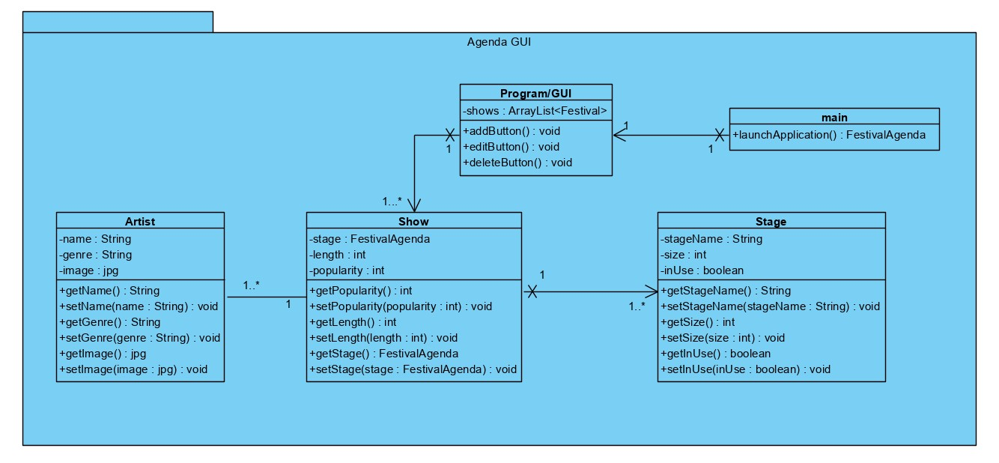
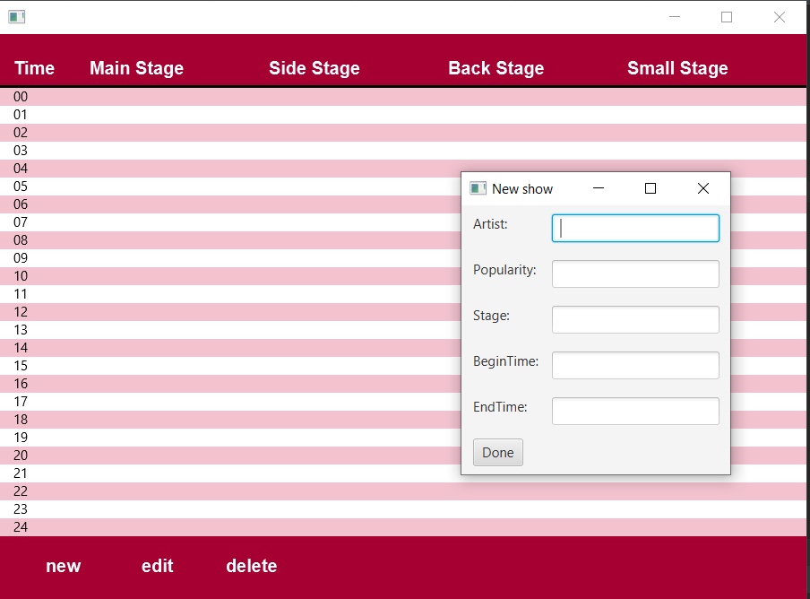
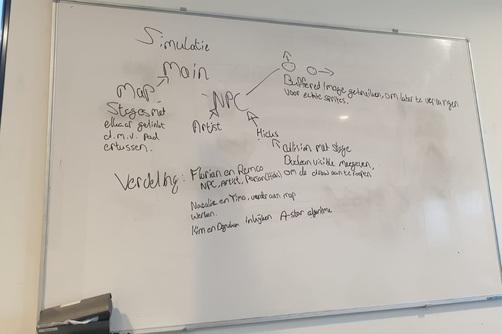
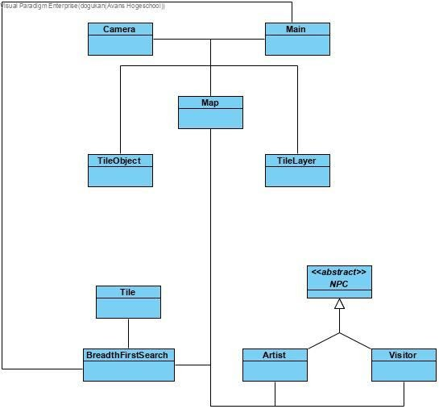
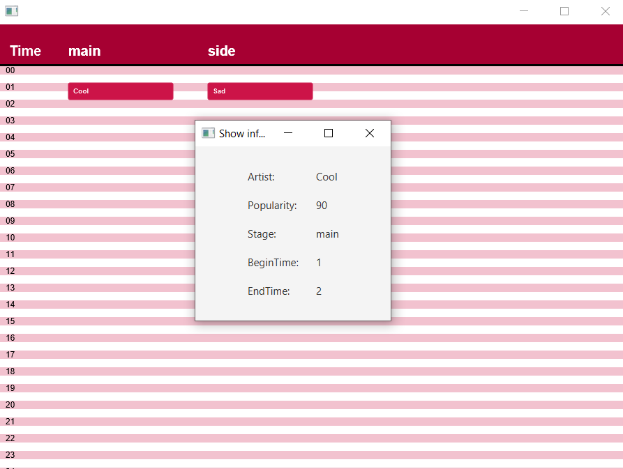
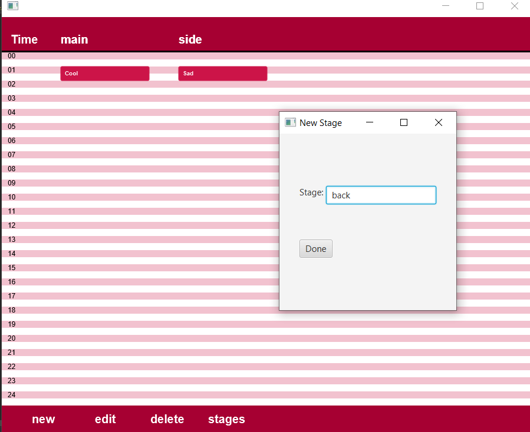
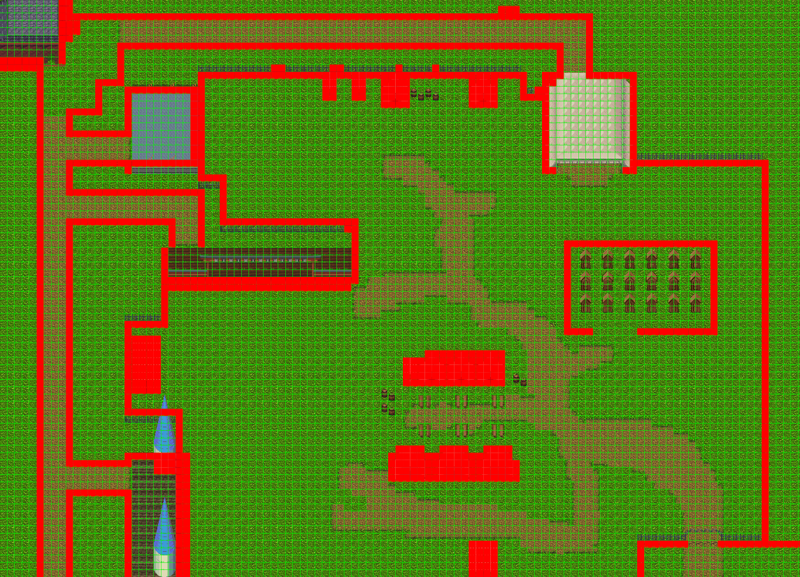
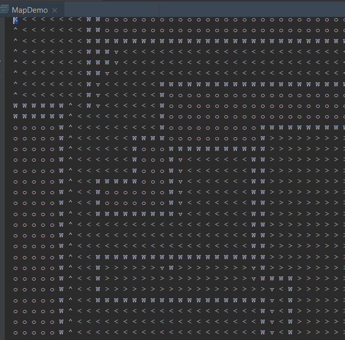

# Portfolio
## Kim Veldhoen 
## Studentnummer: 2154630
## Jaar 1, klas B

# Inhoud:
1. [`Wekelijkse reflectie`](#wekelijkse-reflectie)
2. [`Vakinhoudelijke reflectie`](#vakinhoudelijke-reflectie)
3. [`Stelling`](#stelling)
4. [`JSON applicaties`](#json-applicaties)

# Wekelijkse reflectie 
## Week 2:
In deze week zijn we gestart met de opzet van de agenda GUI. Voor het maken van het klassendiagram hebben we, in de eerste week, een opzet gemaakt van hou de GUI eruit zou moeten zien en welke functies deze nodig had.

Hierbij hebben we verschillende klassen opgezet waarin de agenda GUI zelf, de datastore, de shows, artists en podiums aangemaakt kunnen worden.

Ieder persoon van de projectgroep kreeg een klasse aangewezen om deze week te maken. Remco en ik zijn beide begonnen aan de agenda GUI klasse zelf.
In deze week heb ik een aantal veranderingen gemaakt aan de GUI klas. Dit in overleg met de rest van de project groep, omdat bepaalde aspecten die in week 1 in de GUI klas zijn geïmplementeerd niet aan onze eisen voldoen. 

## Week 3:
In deze week zijn we verder gaan werken aan de functionaliteiten van de agenda GUI.
Ik heb in de GUI klas een aantal aanpassingen gedaan aan hoe de knoppen van de verschillende stages (new, edit, delete) shows aanmaken, bewerken, en opslaan.
Dit in combinatie met gebruik van ObjectIO wat Florian heeft geïmplementeerd. Hiermee kunnen we nieuwe shows aanmaken en opslaan, shows ophalen en deze bewerken, shows individueel verwijderen, of alle shows tegelijk verwijderen.

## Week 4:
In deze week zijn we begonnen met het inladen van JSON-files in InteliJ. Hiermee kunnen we een aparte file maken wat als "map" achtergrond gebruikt kan worden.
Hierop plaatsen we de vier verschillende podiums, toiletten, eettentjes en rustplaatsen waar de karakters op kunnen rondlopen.
Verder hebben we tijdens het senior gesprek met Johan besproken dat we de individuele portfolio's in de git-repository van het project toevoegen. Hierdoor is de toegang tot onze portfolio's voor onze eigen senior, Joep, makkelijker.

## Week 5:
In deze week zijn we begonnen met de opzet van de festival simulatormodule. Hiervoor hebben we een globaal overzicht gemaakt van welke klassen er nodig zullen zijn.
Op basis van de globale opzet kunnen we een klassendiagram maken van welke klassen er nodig zijn voor de simulator zelf.

Wanneer de klasse voor NPC en gasten af is, kunnen de karakters op de map worden ingeladen. In eerste instantie testen we of deze karakters over de map heen kunnen lopen en of de collisiondetection goed werkt.
In week 6 kunnen we met A* pathfinding ervoor zorgen dat deze karakters tussen de verschillende podiums, toiletten en eettentjes kunnen lopen.
Zo kan het gedrag van gasten op een festival gesimuleerd worden en kunnen de knelpunten van het festival terrein in kaart worden gebracht.

## Week 6:
In deze week zijn we begonnen met het implementeren van het pathfinding algortitme. Na het opstart college hebben we besloten om Breath First Search (BFS) toe te passen in plaats van A*. Dit omdat uit het opstart college naar voren kwam dat A* lastiger wordt voor een simulatie met veel NPC's.
We hebben als eerst ervoor gezorgd dat we de collision laag van de JSON file konden uitlezen en al deze data in een grid konden zetten. Nadat alle juiste data in een grid vorm met de afmetingen van de map was gezegt, konden we beginnen met het implementeren van de BFS op deze grid.
In deze week hebben Dogukan en ik alleen de collision laag kunnen omzeten in een grid en hierop de collisie blokken kunnen tekenen. Met het BFS zijn wij helaas niet verder gekomen.

## Week 7:
In deze week zijn Dogukan en ik verder gegaan met het implementeren van BFS. We liepen vorige week uit omdat we vast zaten met het coderen van de BFS. We hebben na veel onderzoek de omliggende cellen van 1 gridpositie kunnen checken of het een muur of geen muur is.
Na hulp van een mede-student zijn we uiteindelijk verder gekomen en hebben we een extra Tile en BreadthFirstSearch klasse toegevoegd. In de Tile klasse staat alle informatie wat betreft de tile dat het algoritme aan het odnerzoeken is, en in de BFS klasse staat alles wat te maken heeft met het pathfinding algoritme.
Vervolgens is in de MapMain klasse verschillende routes toegevoegd die corresponderen met de podia voor de artists en de view area's van de visitors. Door de opgeslagen shows uit te lezen van de datastore, kan worden gekeken naar de naam van de artist en naar welk podium deze moet gaan op welke tijd.
Afhankelijk van de begin tijd van een show, kan voor de visitors worden gekeken naar het podium dat is opgeslagen, en kan via de voorafingestelde route naar de juiste viewa rea gelopen worden.
Daarnaast hebben wij als groep de globale opzet van alle klassen herzien en hierop een nieuw klassendiagram aangemaakt dat de verbinding tussen de verschillende features en klassen moet weergeven.

## Week 8:
In deze week hebben wij de verschillende feature branches van het project bij elkaar gevoegd. We hebben alle packages en klassen moeten refactoren zodat deze verschillende features met elkaar samenwerken.
Verder hebben we het voor elkaar gekregen dat er NPC's op de map gespawn kunnen worden. Deze NPC's kunnen vervolgens zelfstandig naar een aangegeven target toe lopen. 
Zodra de NPC's bij het target zijn aangekomen, kunnen deze in het aangegeven targetArea vrij rondlopen. Tevens zullen de NPC's meeschalen wanneer de map in en uitgezoomed wordt. 
Verder hebben we de agenda module aangepast. Wanneer nu op een show wordt gedrukt, dan komt er een nieuw venster met daarin alle informatie over de show en kunnen podia worden toegevoegd en verwijderd. Zo ziet de agenda er zelf wat netter uit.

## Week 9:
In deze week hebben wij alles laatste puntjes op de i gezet. De visitors kunnen na deze week naar verschillende podia toe lopen op basis van populariteit van de artist die daar optreedt. De pathfinding werkt voor de visitors en de artists. Er is een tijdsbalk toegevoegd waarmee je terug kan kijken naar een moment eerder oo de gesimuleerde dag.
Verder hebben wij een presentatie gemaakt en ons voorbereid op het assessment

# Vakinhoudelijke reflectie 
## VR Week 2:
In week 1 hebben we een opzet gemaakt voor de GUI van de agenda. Hier hadden we een tabel in verwerkt, maar dit bleek uiteindelijk niet te voldoen aan onze eisen omdat we hiermee geen gebruik konden maken van java2D.
Hierdoor heb ik in week 2 de hele GUI klas omgebouwd waardoor deze wel gebruik kon maken van java2D.
In de GUI klas hebben we ook gebruik gemaakt van de popup klas van Java zelf. Deze popups heb ik, na het ombouwen van de GUI klas, achterwegen gelaten omdat deze niet het effect gaven wat we eigenlijk hadden verwacht.
Ik heb in plaats van de popups nieuwe klassen aangemaakt voor elke actie die we willen gebruiken: het toevoegen van een nieuwe show, het bewerken van een bestaande show, en het verwijderen van een bestaande show.
Wanneer er nu op een bepaalde knop wordt gedrukt (new, edit, delete), zal er een nieuwe instantie van de desbetreffende klas worden aangemaakt.
Hierin kan doormiddel van tekstvelden informatie worden ingevoerd die een (nieuwe) show zullen aanmeken.
Deze show wordt voor nu opgeslagen in een ArrayList met shows die vanuit de datastore klas kan worden opgeslagen en opgevraagd.

## VR Week 3:
Deze week heb ik samen met Florian er voor gezorgd dat de informatie van de tekstvelden worden opgeslagen door gebruik te maken van ObjectIO.
Wanneer nu, tijdens het aanmaken van een nieuwe show, op de 'done' knop gedrukt is zal er eerst worden gekeken of er een artist name is ingevuld in het artists tekstvak.
Als dit niet het geval is, dan kan er niet op 'done' gedrukt worden. Dit om er voor te zorgen dat er geen shows worden opgeslagen zonder artist.
Wanneer er wel een artist naam is ingevuld, maar de rest van de tekstvakken zijn leeg dan zullen deze een standaard waarde van '0' meekrijgen. Deze zijn bij het bewerken van de show, editStage, aan te passen.

    doneButton.setOnAction(e -> {
        if(!artistField.getText().isEmpty()){
            newShow.setShow(artistField.getText());
            } else {
                artistField.setText("please type in a name");
            }
            if(!beginTimeField.getText().isEmpty()
              && Integer.parseInt(beginTimeField.getText()) != Integer.parseInt(endTimeField.getText())
              && Integer.parseInt(beginTimeField.getText()) < Integer.parseInt(endTimeField.getText())){
                newShow.setStartTime(Integer.parseInt(beginTimeField.getText()));
            } else {
                newShow.setStartTime(0);
            }
            if(!endTimeField.getText().isEmpty()){
                newShow.setEndTime(Integer.parseInt(endTimeField.getText()));
            } else {
                newShow.setEndTime(0);
            }
            if(!popularityField.getText().isEmpty()){
                newShow.setPopularity(Integer.parseInt(popularityField.getText()));
            } else {
                newShow.setPopularity(0);
            }
            if(!stageField.getText().isEmpty()){
                newShow.setStage(Integer.parseInt(stageField.getText()));
            } else {
                newShow.setStage(0);
            }
            
            this.showList.add(newShow);
            newStage.close();
                 
            if (!this.showList.isEmpty()){
                serializer.Write(this.showList);
            }
    });

Bij het verwijderen van een show zal eerst worden gevraagd of de gebruiker zeker weet of hij/zij deze show wilt verwijderen. Nadat op 'yes' is gedrukt, zal de desbetreffende show uit de lijst worden gehaald.
     
    yesButton.setOnAction(e -> {
        if (!deserializer.Read().isEmpty()){
            showList = deserializer.Read();
        }
        showList.remove(index);
        serializer.Write(showList);
        delStage.close();
    }); 
    
## VR Week 4:
Deze week heb ik mij verdiept in het inladen en uitlezen van JSON-files in Java en IntelliJ. Het maken van de achtergrond/map hebben wij gedaan met behulp van Tiled. Wanneer we de map exporteren wordt deze omgezetn in een JSON file.
In Java kan je met een JsonObject dit soort files uitlezen:

        JsonObject root;
        
        JsonReader reader = null;
        reader = Json.createReader(getClass().getResourceAsStream(filenName));
        this.root = reader.readObject();
        
        this.width = this.root.getInt("width");
        this.height = this.root.getInt("height"); 
     
Met dze "root" kunnen verschillende attributen uit de JSON file worden opgeroepen. Bij het uitlezen van de verschillende layers die wij hebben gebruikt worden deze layers in een ArrayList gezet.
Wanneer door de ArrayList met layers wordt gegaan, wordt eerst gekeken of de visibility van de layer aan staat. Zo ja, dan wordt door de gehele lengte en hoogte van de map per coordinaat gekeken naar de RGB waarde van dat coordinaat.

## VR Week 5:
Deze week zijn we begonnen met de simulatie module van het festival. We hebben een globale opzet gemaakt van de klassen die we denken nodig te hebben:
Main - om de simulatie te starten
Map - voor het inladen van de JSON file en het laten zien van de map
NPC - is een superklasse waar de klassen Artist en Visitor van erven.
Artist en Visitor - werken hetzelfde, alleen krijgen ze een andere sprite
Deze week heb ik mij verdiept in A* pathfinding. Wij waren van plan A* te gebruiken omdat merendeel van de project groep hier al van had gehoord. Bij het onderzoek doen naar A* heb ik in pseudocode een paar klassen gemaakt met attributen waarvan ik dacht deze nodig te hebben.

## VR Week 6:
Deze week hebben mijn projectgroep en ik er voor gekozen om, in plaats van het A* pathfinding te gebruiken, het Dijkstra-pathfinding te implementeren. Dit omdat dit algoritme tijdens het opstart college kort is uitgelegd en omdat Johan zei dat het Breath Frist Search (BFS) makkelijker toe te passen is op een simulatie met veel NPC's (zoals in ons geval).
Samen met de projectgroep hebben we op de map een collisionLayer aangemaakt waarin de grenzen van de map zijn aangegeven.

In de afbeelding staan alle rood getekende vierkanten voor een collisionTile. Dit betekend dat de NPC's niet op deze tile kunnen lopen. Als eerste hebben Dogukan en ik ons verdiept in het BFS algortime.
Vervolgens hebben we met hulp van Timo en Nathalie de collisionLayer uit de JSON file kunnen halen en hebben wij de data hiervan kunnen opslaan in een 2D Array met de hoogte en breedte van de map zelf.
 
    for (int y = 0; y < height; y++){
        for (int x = 0; x < width; x++) {
            int gid = map[y][x];
            this.tileMap[y][x] = new Tile(new Point2D.Double(x,y), false, false, false);
                                     
            if (gid == 0) {
                graphics.setColor(Color.GREEN);
                graphics.draw(new Rectangle2D.Double(x * tileWidth, y * tileHeight, 32, 32));
                Font font = new Font("Arial", Font.PLAIN, 5);
                graphics.setFont(font);
                graphics.drawString("(" + (int) gridPos.getX()/32 + " , " + (int) gridPos.getY()/32 + ")", (x * tileWidth), (y * tileHeight));                        
            } else if (gid == 975) {
                graphics.setColor(Color.RED);
                graphics.fill(new Rectangle2D.Double(x * tileWidth, y * tileHeight, 32, 32));
                this.tileMap[y][x].setWall(true);
                                    
            }
        }
    }
In bovenstaande code hebben we een geneste for-loop. Hiermee wordt er door elke rij en kolom heen gegaan en wordt gecheckt of de gid op die plaats 0 of 975 is (met 975 als collisonTile).
Als de gid overeen komt met 975, dan zetten we de voor die tile de boolean setWall op true. Voor visuele validatie, wat betreft het corrcet uitlezen van de map, hebben wij voor de zekerheid deze tiles met een rood blokje aangegeven.
Nadat we deze grid hadden gemaakt, kwamen we compleet vast te zitten. Hierom hebben wij hulp gevraagd bij medestudenten, wij hebben deze week dezelfde vragen aan Joep (onze senior) gevraagd, maar hierop kregen wij geen antwoord.

## VR Week 7:
In deze week zijn Dogukan en ik verder gegaan met het uitzoeken van de BFS. We hebben ieder voor zich geprobeerd het BFS algortime te implementeren om deze vervolgens samen na te gaan om zo tot één geheel te komen.
Ik heb mij voornamelijk bezig gehouden met het uitprinten van een adjacency map van de tileMap. Voor het implementeren van het BFS algoritme heb ik de klasse Tile aangemaakt,
In de Tile klas wordt een int x en int y meegegeven als start punt. Verder heeft deze klassen getters en setters voor de x, y en de boolean isWall.
Met het aanmaken van een nieuwe Tile heb ik geprobeerd om de vier omliggende cellen (links, rechts, boven, onder) te kunnen detecteren. Door de twee geneste for-loops kon ik een x en y waarde opvragen, om vervolgens hiermee met vier if-statements om de desbetreffende cel heen te kijken.
    
    Tile start  = new Tile(int x, int y);
    Queue<Tile> open = new LinkedList<Tile>();
    ArrayList<Tile> closed = new ArrayList<Tile>();
    Tile current = start;
    open.add(start);
    
    while(!open.isEmpty()){
        closed.add(open.poll());
        //Check de omliggende tiles
        if (i > 0 && array[i-1][j] == 0 && !closed.contains(new Tile(i-1, j))) //Voor cel boven
            open.add(new Tile(j, i-1);
        if (j > 0 && array[i][j-1] == 0 && !closed.contains(new Tile(j-1, i))) //Voor cel links
            open.add(new Tile(j-1, i);
        if (j + 1 < array[1].length && array[i][j+1] == 0 && !closed.contains(new Tile() //Voor cel rechts
            open.add(new Tile(j+1, i);
        if (i + 1 < array.length && array[i+1][j] == 0) //Voor cel onder
            open.add(new Tile(j, i+1)
    }
    
Hierbij heb ik geprobeerd om als eerste te kijken of de cel links/rechts/boven/onder uberhaüpt in de grid zit of niet. Wanneer dit niet het geval was wordt er een nieuwe tile van die positie aangemaakt ne in de Queue open gezet.
Dit bleek niet geweldig te werken. Vervolgens hebben Dogukan en ik onze codes samen doorgekeken en hebben we een paar aanpassingen gedaan aan de Tile klasse en het doorlopen van de 2D Array. Helaas zijn we er niet zelf uitgekomen, ook niet met het senior gesprek met Joep.
Daarom hebben we weer de hulp van onze medestudent gevraagd. Op basis van zijn uitleg zijn hebben Dogukan en ik aanpassingen gedaan in de klassen: Tile, Map, BreathFirstSearch en de main.
De Tile klasse vraagt nu om een Point2D, boolean isWall, boolean isDestination, boolean isVisited.
De BreathFirstSearch klasse bevat het BFS algoritme en het checken van de omliggende cellen, in plaats van in de main. Het zetten van een tileMap op basis van de 2D Array die we aanmaken in de map klasse.
    
    if(inGrid(pos.getX(), pos.getY())){
        this.queue = new LinkedList<Tile>();
        grid[(int)pos.getY()][(int)pos.getX()].setDestination(true);
        grid[(int)pos.getY()][(int)pos.getX()].addRoute("route 1", new Point2D.Double(0,0));
        grid[(int)pos.getY()][(int)pos.getX()].setVisited(true);
    }
      
De code om de buren te controleren is nu veranderd in:
        
    //Dit dan voor elke richting dan voor alleen de cel onder
    if(inGrid(pos.getX(), pos.getY() + 1)){
        final Tile checkTile = this.grid[(int)pos.getY() + 1][(int)pos.getX()];
        if(!checkTile.isWall() && !checkTile.isVisited() && !checkTile.isDestination()){
            checkTile.addRoute(route, new Point2D.Double(0,-1));
            checkTile.setVisited(true);
            queue.add(checkTile);
        }
    }

Met een HashMap kunnen we karakters meegeven aan verschillende routes (voor verschillende targets):

    //Dit dan voor elke richting
    if (bfs.getTileMap()[y][x].isWall()) {
        System.out.print("W ");
    } else if (bfs.getTileMap()[y][x].getRoute().get("route 1") == null) {
        System.out.print("o ");
    } else if (bfs.getTileMap()[y][x].getRoute().get("route 1").getX() == 1) {
        System.out.print("> ");
    } else if (bfs.getTileMap()[y][x].getRoute().get("route 1").getX() == -1) {
        System.out.print("< ");
    
Zodat we uiteindelijk als resultaat krijgen:

Met "o" wanneer de Tile onbereikbaar is, "W" wanneer de Tile de boolean isWall = true bevat, en pijltjes voor de richting wanneer de Tile naar een andere Tile moet lopen

## VR Week 8:
In deze week hebben mijn projectgroep en ik de verschillende branches en features bij elkaar toegevoegd en ervoor gezorgd dat deze goed met elkaar communiceren en werken. Zo kan er nu vanuit de datastore de show lijst worden opgevraagd waarmee de BFS een route kan genereren op basis van de informatie van de verschillende shows.
We hebben ook gekozen voor nieuwe sprites met een afmeting van 32x32, omdat de vorige sprites 2x zo groot waren en niet netjes meeschaalde wanneer er in en uit werdt gezoomd op de map.
We hebben er voor gekozen dat, wanneer een artist of een visitor bij een bepaald punt op het podium of de view area komt, de artist en visitor dan naar random gegenereerde plekken op de aangegeven area zal rondlopen. In de JSON file is deze area aangegeven als TargetArea met een bepaalde hoogte en breedte. De artists en visitors zullen dus binnen deze afmetingen "rondlopen".

## VR Week 9:
In deze week hebben mijn project groep en ik voornamelijk de punjtes op de i gezet. Hierbij hebben we er voor kunnen zorgen dat de visitors ,op basis van de populariteit van de artist, zich verdelen over de verschillende podia.
Tevens is er een tijdbalk toegevoegd waarmee de gebruiker eerder gesimuleerde momenten van de dag kan terugzien. Verder hebben wij ons voobereid op het assessment voor de komende week.

# Stelling:
In het bedrijfsleven wordt steeds meer in software gesimuleerd. De werking van verschillende producten die bedrijven produceren hangen af van meerdere factoren. Wanneer een product, in dit geval een festival, bestaat uit meer gecompliceerde factoren dan wordt de faalkans voor dit product groter.
Door het product eerst virtueel te simuleren kunnen eventuele knelpunten en risicofactoren van te voren worden weergegeven, in plaats van dat deze tijdens het testen van het product zelf naar voren komen.
Bedrijven kunnen bijvoorbeeld verschillende transportsystemen in hun fabrieken simuleren en kijken of er aanpassingen gedaan kunnen worden aan de infrastructuur of het optimaliseren van motoren.
Simulaties van dit soort systemen geven de gebruikers direct inzicht of de doelstelling en eisen van het uiteindelijke product haalbaar zijn. Wanneer tijdens de simulatie blijkt dat deze eisen niet haalbaar zijn, dan kan daar gemakkelijk op worden ingespeeld door bepaalde factoren in de simulatie aan te passen. Hierdoor worden de kosten voor het testen van producten aanzienlijk verlaagd.
Niet alleen kunnen de uiteindelijke kosten lager uitkomen, ook kan het uiteindelijke product sneller worden opgeleverd of op de markt worden gebracht. Daarnaast kunnen bedrijven nu makkelijker nieuwe iedeeën op het product testen.
In ons geval maken wij een simulatie van een festival om te zien waar eventuele knelpunten op het eigenlijke festivalterrein naar voren kunnen komen. Door deze sitautie te simuleren kunnen festivalhouders beter inschatten waar bijvoorbeeld extra ruimte moet worden gecreërd voor de bezoekers, of waar extra personeel moet staan zodat de doorstroom van bezoekers zo soepel mogelijk verloopt.

## Conclusie
Het simuleren in software in het bedrijfsleven zal steeds meer toenemen. Door het simuleren van producten onder verschillende toestanden kunnen eventuele knelpunten sneller naar voren laten komen zodat bedrijven hierop sneller kunnen reageren.
Dit zorgt ervoor dat de uiteindelijke kosten van het product minder worden doordat er niet elke keer weer een testproduct gemaakt hoeft te worden waarop verschillende tests uitgevoerd worden.

[Bron: Bits&Chips](https://bits-chips.nl/artikel/multiple-v-brengt-fouten-eerder-aan-het-licht/)

[Bron: Design Solutions](https://blog.designsolutions.nl/hoe-kan-simulatie-software-bijdragen-aan-betere-innovaties)

# JSON applicaties
JSON staat voor JavaScript Object Notation en is een gemakkelijke en lichtgewicht data-uitwisselings format. JSON wordt voornamelijk gebruikt om data tussen server en web applicatie te verzenden als alternatief voor XML.
JSON is gebaseerd op een subset van JavaScript, maar is niet gelijk aan JavaScript.

1. Websites
2. Web servers
3. Smartwatch apps

Deze applicaties maken gebruik van JSON voor het verzenden en ontvangen van data tussen server en applicatie. Dit wordt gebruikt voor het verzenden en omzetten van verschillende soorten gestructreerde data.
Tevens zorgt JSON ervoor dat er niet wordt gewacht tot API calls terug komen van de server (asynchronous calls). Terwijl het programma blijft functioneren zal een "callback" functie worden uitgevoerd wanneer een call terug komt van de server. Veel JavaScript gebaseerde applicaties, waaronder websites, gebruiken hierom JSON.
Smart watches, net zoals elk ander type aparaat dat verbinding kan maken met het internet en een web server, gebruiken JSON om zo publieke data op te vragen.